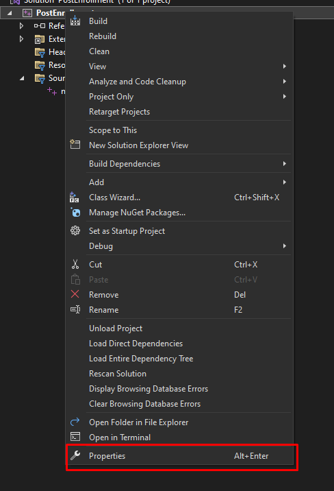
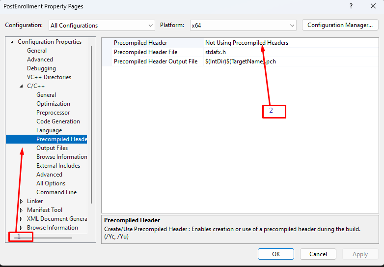
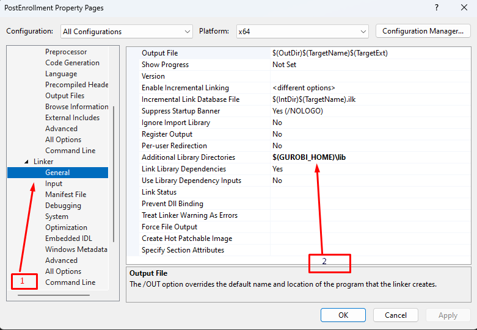
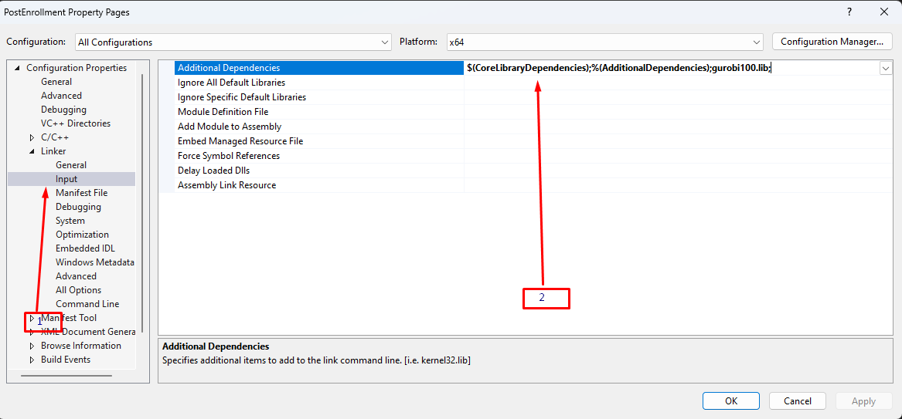
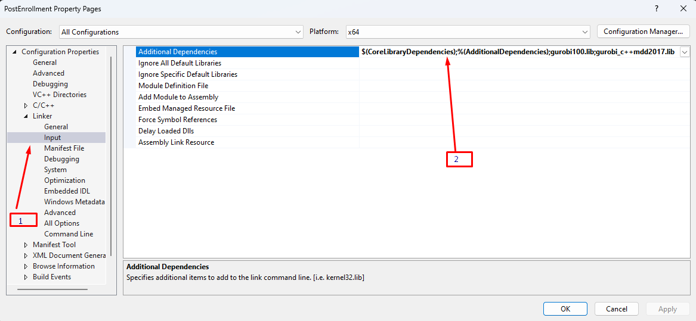
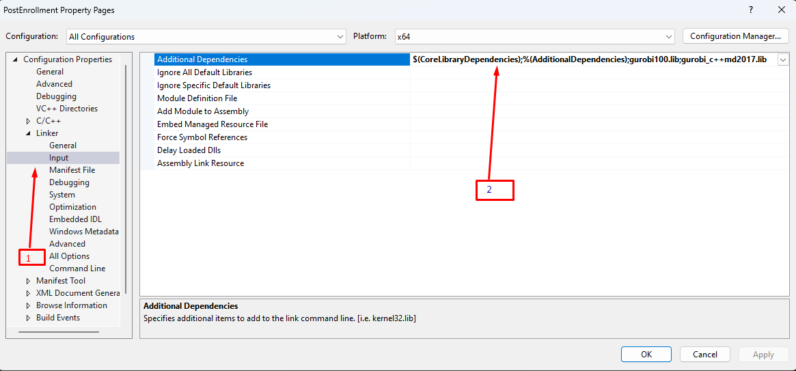

### Install gurobi for C++ in visual studio

* Right-click on the project name in the Solution Explorer panel, then select Properties.

* Set Platform to x64

* Set Configuration to All Configurations

    

* Under Debugging set Environment to PATH=$(PATH);$(GUROBI_HOME)\lib
    
    

* Under C/C++ > General > Additional Include Directories, add: $(GUROBI_HOME)\include
    
    

* Under C/C++ > Precompiled Headers > Precompiled Header, select Not Using Precompiled Headers
    
    

* Under Linker > General > Additional Library Directories, add: $(GUROBI_HOME)\lib
    
    

* Set Configuration to Debug

* Under Linker > Input > Additional Dependencies, add gurobi100.lib; gurobi_c++mdd2017.lib
    
    

* Set Configuration to Release

* Under Linker > Input > Additional Dependencies, add gurobi100.lib; gurobi_c++md2017.lib
  
    

**When building your project, make sure the current target in the Visual Studio toolbar is x64 (it usually defaults to x86).**